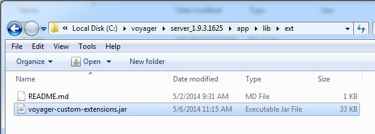
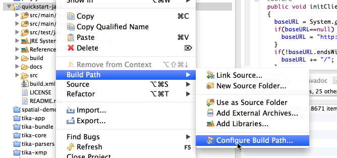

# Voyager Java Quickstart

This purpose of this project is to provide simple examples of extending Voyager with Java.

 * [Query Voyager](docs/query.md)
 * [Custom Extractors and Mimetypes](docs/extractors.md)
 * [Working with DiscoveryJobs](docs/discoveryjob.md)
 * [REST API Access](docs/rest.md)
 * [Custom Locations](docs/locations.md)
 * [Integration Tests](docs/integration.md)

JVM Requirements:

  * Voyager runs on Java 1.7+
  * The Oracle JVMs have been tested successfully. Other JVMs have are untested and their viability is unknown. 
  * Check [Lucene JavaBugs](http://wiki.apache.org/lucene-java/JavaBugs) before deciding a deployment JVM.

System Requirements:
  * This project uses [Apache Ant](http://ant.apache.org/)

Getting Started
---------------

To get started, download Voyager [here](http://voyagersearch.com/download)

This Quickstart Guide is also included in the Voyager distribution in the `${install.dir}dev/java/quickstart`folder. The default installation directory is `c:\voyager\server_1.9\dev`

When running these samples from the `${install.dir}/dev/java/quickstart` folder, simply run:

    ant

When running from elsewhere (such as a local clone of this repository) point to the Voyager install by setting the `voyager.dir` system property:

    ant -Dvoyager.dir=c:\voyager\server_1.9

Installing in Voyager
---------------------

After running ant successfully, a jar file will be created in:

    build/voyager-custom-extensions.jar

Copy this file to your `${app.dir}/lib/ext` folder.  Alternatively you can run

    ant install
    
This will build the extension and copy it to the configured voyager instance:

    install:
         [copy] Copying 1 file to /Users/ryan/workspace/voyager/test/artifact/Voyager/app/lib/ext
         [copy] Copying /Users/ryan/workspace/quickstart-java/build/voyager-custom-extensions.jar to /Users/ryan/workspace/voyager/test/artifact/Voyager/app/lib/ext/voyager-custom-extensions.jar
    
    BUILD SUCCESSFUL
    Total time: 3 seconds

Check that your .jar file is in the `${app.dir}/lib/ext` folder and restart voyager:

   

After restarting voyager, your custom code will be loaded in Voyager.

See [Custom Locations](docs/locations.md#adding-custom-locations-from-the-ui) for how some of these extensions will appear.

Setting up Eclipse
------------------

This repository contains an Eclipse project that allows to run the samples from the Eclipse IDE.

From Eclipse:

1. Import this directory as an [existing project](http://help.eclipse.org/juno/index.jsp?topic=%2Forg.eclipse.platform.doc.user%2Ftasks%2Ftasks-importproject.htm).
1. Set up a [Classpath Variable](http://help.eclipse.org/juno/index.jsp?topic=%2Forg.eclipse.jdt.doc.user%2Freference%2Fpreferences%2Fjava%2Fbuildpath%2Fref-preferences-classpath-variables.htm) named `VOYAGER_DIR` that points the Voyager directory. 

   Right click on the project to configure the build path:
   
   
   

   Configure your variable:
   
   
   

Quickstart Distribution
-----------------------
This file is included in the standard Voyager [download](http://voyagersearch.com/download).  The version info is listed below:
<pre>
Original Source: 
https://github.com/voyagersearch/quickstart-java.git
 
Date: 
@touch.time@

Version: 
https://github.com/voyagersearch/quickstart-java/commit/@githash@
</pre>

