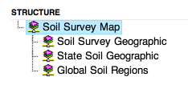
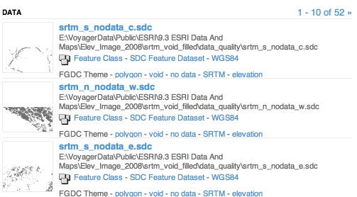

Sample Discovery Jobs
=====================
> This page was autogenerated by [JobSamples.java](../src/main/java/voyager/quickstart/discovery/JobSamples.java) on Tue Mar 18 22:19:26 PDT 2014


## Add a file
Add a file to the system
```json
{
  "action": "ADD",
  "path": "/Users/ryan/workspace/quickstart-java/docs/imgs/links.png",
  "entry": {"fields": {
    "format": "image/png",
    "bytes": 70154
  }}
}
```

## Add a URL
Add a URL to the system
```json
{
  "action": "ADD",
  "path": "http://public.voyagergis.com/kml/TheBestPlaces.kml",
  "entry": {"fields": {
    "name": "TheBestPlaces",
    "format": "application/vnd.google-earth.kml+xml"
  }}
}
```

## Add record without a resource reference
Fill in all the explicit properties
```json
{
  "id": "record1234",
  "action": "ADD",
  "entry": {
    "geo": {
      "lat": 37.78875904932722,
      "lon": -122.38787244901528
    },
    "meta": {"body": "<xml>raw XML metadata<\/xml>"},
    "fields": {
      "name": "Name (1395206366178)",
      "abstract": "some longer text about what we have",
      "copyright": "some copyright message"
    }
  }
}
```

## Entry with structure
children with <code>index: false</code> will appear in the tree, but not have their own record

```json
{
  "id": "tree_1234",
  "action": "ADD",
  "entry": {
    "fields": {
      "name": "Tree Root",
      "abstract": "some longer text about what we have"
    },
    "children": [{
      "index": false,
      "fields": {"name": "Sub 1"},
      "children": [
        {"fields": {
          "name": "Child 0",
          "abstract": "more info in an entry (0)"
        }},
        {"fields": {
          "name": "Child 1",
          "abstract": "more info in an entry (1)"
        }},
        {"fields": {
          "name": "Child 2",
          "abstract": "more info in an entry (2)"
        }}
      ]
    }]
  }
}
```
The tree structure is displayed in the ui as:




## Entry with links
Items with links to other data.

```json
{
  "id": "with_links_1234",
  "action": "ADD",
  "entry": {
    "geo": {
      "xmin": -88.59375,
      "ymin": 24.766785,
      "xmax": -78.222656,
      "ymax": 31.128199
    },
    "fields": {
      "name": "Item With Links",
      "abstract": "some longer text about what we have"
    },
    "links": [
      {
        "relation": "data",
        "name": "linked data",
        "path": "/Users/ryan/workspace/quickstart-java/docs/imgs/links.png",
        "format": "image/png"
      },
      {
        "relation": "data",
        "name": "tree data",
        "path": "/Users/ryan/workspace/quickstart-java/docs/imgs/structure.png"
      }
    ]
  }
}
```
Links are displayed in the ui as:




## Entry with structure and child documents get indexed
When you add the '__to_extract', field, the child items are added to the extraction queue.

```json
{
  "id": "tree_and_extract",
  "action": "ADD",
  "entry": {
    "fields": {
      "name": "Tree Root",
      "abstract": "some longer text about what we have"
    },
    "children": [{
      "index": false,
      "fields": {"name": "Sub 1"},
      "children": [
        {"fields": {
          "name": "The Links PNG",
          "format": "image/png",
          "title": "Some Title From the Job",
          "path": "/Users/ryan/workspace/quickstart-java/docs/imgs/links.png",
          "__to_extract": true
        }},
        {"fields": {
          "name": "A Structure PNG",
          "abstract": "an abstract field",
          "path": "/Users/ryan/workspace/quickstart-java/docs/imgs/structure.png",
          "__to_extract": true
        }}
      ]
    }]
  }
}
```
After extraction, all fields configured by the parent will exist in the child.
