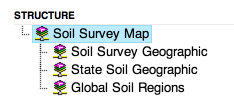
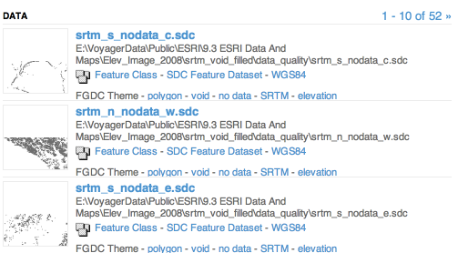

Working With DiscoveryJob
=========================

The following code is autogenerated using [RestSamples.java]


### Simple Discovery Job
A simple job with no external file reference
```json
{
  "id": "simple_1234",
  "action": "ADD",
  "entry": {
    "meta": {"body": "<xml>raw XML metadata<\/xml>"},
    "fields": {
      "name": "Name (1381454934615)",
      "abstract": "some longer text about what we have"
    }
  }
}
```
### Entry with internal structure
children with <code>index: false</code> will appear in the tree, but not have their own record

```json
{
  "id": "tree_1234",
  "action": "ADD",
  "entry": {
    "fields": {
      "name": "Root Tree (1381454934624)",
      "abstract": "some longer text about what we have"
    },
    "children": [
      {
        "index": false,
        "fields": {"name": "sub0"}
      },
      {"fields": {
        "name": "sub5",
        "author": "This is the author tag"
      }},
      {
        "index": false,
        "fields": {"name": "sub8"}
      },
      {
        "index": false,
        "fields": {"name": "sub0"}
      },
      {"fields": {
        "name": "sub3",
        "author": "This is the author tag"
      }},
      {"fields": {
        "name": "sub1",
        "author": "This is the author tag"
      }},
      {"fields": {
        "name": "sub3",
        "author": "This is the author tag"
      }},
      {"fields": {
        "name": "sub9",
        "author": "This is the author tag"
      }},
      {"fields": {
        "name": "sub5",
        "author": "This is the author tag"
      }},
      {"fields": {
        "name": "sub1",
        "author": "This is the author tag"
      }}
    ]
  }
}
```
The tree structure is displayed in the ui as:



### Entry with links to data
Items with links to other data.

```json
{
  "id": "with_links_1234",
  "action": "ADD",
  "entry": {
    "fields": {
      "name": "Link (1381454934627)",
      "abstract": "some longer text about what we have"
    },
    "links": [
      {
        "relation": "data",
        "name": "linked data",
        "path": "c:/path/to/data.xyz"
      },
      {
        "relation": "data",
        "name": "linked data2",
        "path": "c:/path/to/data2.xyz"
      }
    ]
  }
}
```
Links are displayed in the ui as:




