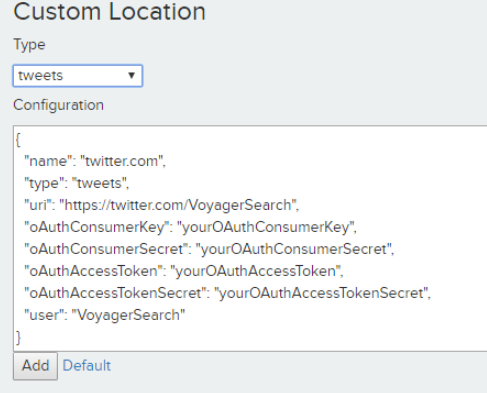
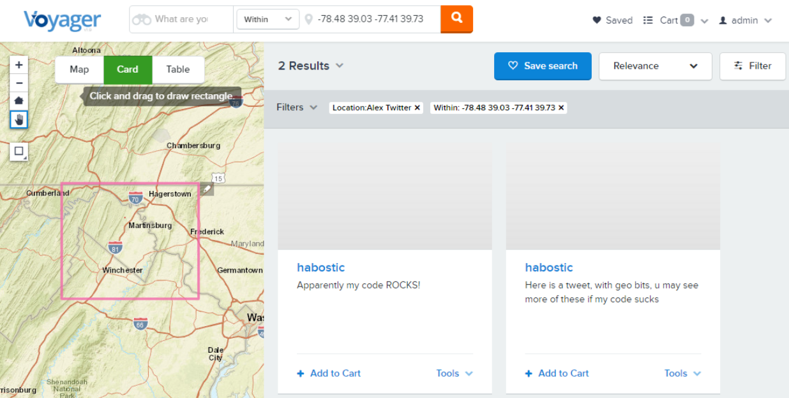

Twitter Custom Location
==============================

This task was given to me as part of an evaluation process for potential new hires
  * ``Overall Skill Level - Senior``
  * ``Java Skill Level - Beginner``
  
This document outlines the process taken to work through the task


### Dev Task - Use Voyager APIs to create a Twitter Based Custom Location
  * ``Install and license the latest prod release of Voyager``
  * ``Clone the repo``
  * ``Implement Custom Location``
  * ``Issue PR``

Install and license the latest prod release of Voyager
------------------------------------------------------
The steps outlined in the task overview document was straightforward.
I was able to download and license the latest 197 release.
Due to not knowing which branch to work off of, I also installed 198 RC1 since master was based on that Voyager Version


Time Spent - 30 mins
Issues - None


Clone the repo
--------------
Cloning the repo was straightforward

Time Spent - 10 mins
Issues - Did not know which branch to use so I decided to use Master


Implement Custom Location
-------------------------
### Choosing and installing an IDE
I installed both Eclipse (because it was mentioned in the read me), and IntelliJ (my preferred Java IDE)

Time Spent - 2hrs
Issues - None

### Installing Ant
I used [chocolatey](https://chocolatey.org/) to install Ant

Time Spent - 30 mins
Issues - None

### Compiling Code
After following the initial directions from read me, I used the IDE build to compile the code.

Initially none of the libs were found so I referenced ```198``` ```{voyager.dir}/app/lib``` directory and this cleared
a majority of the reference issues.

Next, I got a lot of errors pertaining to libs like ```aws\*.jar``` and ```voyager\*.RC1.jar```
This lead me to determine why I was missing libs as I was looking in the '''197''' dir.
Eventually I installed 198 RC1 from jenkins and was able to resolve the libs issue by updating the .classpath file
ie, I have to change some libs names to included RC1 in the name

Doing the above cleared all but one reference.  The reference to ```mockito``` was not satisfied.  I opened the project in Eclipse and did
not get this issue so I attempted to figure out what was wrong with IntelliJ.  After a lot of fruitless research, I finally
found the ```mockito jsr``` in ```{voyager.dir}/dev/java/lib``` folder and referenced.  This solved all my reference issues

From here, the compile did not work as there were about 3 places in the project settings that neeed to reference ```Java 1.8```
Finding them took some time

Once those ```1.8``` reference were taken care of the project compiled.

After compiling the project, I attempted to run

    ant install

This did not work as the ```build.xml``` reference ```<property name="voyager.dir"  value="../../.." />```
So I hard coded the location of ```value``` to the dir of my `198` install.
Eventually, I understood what the readme was saying on how to override settings.  After a while I was able to do this:

    ant -Dvoyager.dir=c:/voyager/server_1.9.8_dev_task/ install

The code compiled fine and copied the correct file to the `ext` dir in my `198` install dir

Time Spent - 6 hrs
Issues - Using the master branch made my Voyager libs incompatible with the repo references
  * Using the master branch made my Voyager libs incompatible with the repo references
  * Finding all the references in IntelliJ that needed to select the correct Java version
  * Not knowing how the `Ant` cmd line worked caused me issues, the note in the `build.xml` was not clear to me 


### Running OTB Custom Locations
To ensure the process worked correctly I ran Voyager and went through the Earthquakes Location workflow

Time Spent - 10 mins
Issues - None

### Running the project
Not that the project compiled and `Ant` build successfully, I attempted to run the code in debug mode.
I pulled in resources to help me (Sam, Trinity, and Justin), but it was determined that debugging could not take 
place within the IDE

Time Spent - 4hrs
Issues - the `readme` made it appear that running from Eclipse was possible, so I spent considerable time trying to get this to work

### Setup new application undr my twitter dev acct
In order to generate the tokens and keys needed, I created a new application under my twitter dev acct

Time Spent - 10mins
Issues - None


### Steps to implement the Twitter Custom Location
  * Copied the files related to the Earthquake Customer Location
  * Updated all names in the code from Earthquake to Twitter
  * Built the code and ran Voyager
  * Location was not listed as an option
    * Added Logging to all the files to determine what was wrong, no logs were filed
    * Eventually found the meta folder and added my [TwitterLocationFactory.java] class to it
    * Now the location displayed as the `Twitter Location` and functioned just like the `Earthquake Location`
  * Updated [TwitterLocation] to reference a twitter uri and Twitter API key
    * Ran Voyager and did not see TwiiterApiKey as something I could configure, eventually noticed I had to:
```
    protected void fillJSONBody(JSONWriter jj) throws JSONException {
       super.fillJSONBody(jj);
       jj.key("oAuthConsumerKey").value(oAuthConsumerKey);
       jj.key("oAuthConsumerSecret").value(oAuthConsumerSecret);
       jj.key("oAuthAccessToken").value(oAuthAccessToken);
       jj.key("oAuthAccessTokenSecret").value(oAuthAccessTokenSecret);
       jj.key("user").value(user);
     }
```
  * Downloaded [Twitter4J](http://twitter4j.org/)
  * Added and Referenced it in my project
  * Implemented some code to get the status from a user name
  * Added Logs to follow the output of the code
  * Deployed code but Voyager failed and logged the fact that it did not know about `Twitter4J`
    * Eventually figured out that I had to add the `Twitter4J` lib to the `{voyager.dir}/app/lib` dir
    * Once I did that I could see the status of my hard coded user in the logs
  * Added in code to [TwitterRunner] class to setField of the doc using the DEX model
```
  doc.setField(DexField.ID.name, status.getId()); // assuming this is globally unique
  doc.setField(DexField.NAME.name, status.getUser().getScreenName());
  doc.setField(DexField.TITLE.name, status.getUser().getScreenName());
  doc.setField(DexField.CREATED.name, status.getCreatedAt());
  doc.setField(DexField.TYPE.name, location.getLocationType());
  doc.setField(DexField.DESCRIPTION.name, status.getText());
  doc.setField(DexField.URI.name, location.getURI());
```
  * Tested to see if this information would get indexed
    * Indexing worked
  * Added in parsing the spatial location if it was available
  
```
   EntryGeo ext = null;
   GeoLocation geo = status.getGeoLocation();
   if(geo != null){
    log.info("Twitter Has Geo {}",geo.getLatitude());
    ext = new EntryGeo(geo.getLatitude(), geo.getLongitude());
   }
   
   // Add the extent fields to the SolrInputDocument
   if(ext!=null && ext.isValid()) {
    ConvertToSearchableDocument.setExtent(doc, ext);
   }
```

  * Lastly I updated the code to get the information from the configuaration rather than the hard code vals

Time Spent - 4hrs
Issues
  * Went back and forth as to whether to use Service Location or Location
  * Went back and forth as to whether or not to use DEX model or just strictly load up the field object
 

### Final Result






### Items to note
  * I ran through the entire process using the `release` branch and not not have the lib conflicts noted earlier
  * I was able to deploy the custom location without any changes

[TwitterLocationFactory.java]:         ../src/main/java/voyager/quickstart/location/twitter/TwitterLocationFactory.java
[TwitterLocation.java]:         ../src/main/java/voyager/quickstart/location/twitter/TwitterLocation.java
[TwitterRunner.java]:         ../src/main/java/voyager/quickstart/location/twitter/TwitterRunner.java


