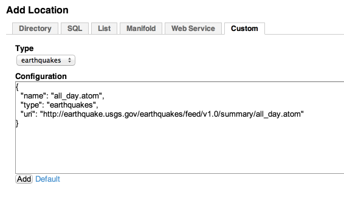

Custom Location
=========================

To create a custom location, you will need to implement three classes:
  * ``Location``
  * ``DiscoveryRunner``
  * ``LocationFactory``

Each Location needs to select a unique name.  These samples include two flavors:


### Earthquakes Location
This is an example that connects to an RSS feed
  * [EarthquakesLocation.java]
  * [EarthquakesRunner.java]
  * [EarthquakesLocationFactory.java]


### MyFolder Location
This is an example with a more complex JSON configuration
  * [MyFolderLocation.java]
  * [MyFolderRunner.java]
  * [MyFolderLocationFactory.java]


Register the LocationFactory
----------------------------
Each ```LocationFactory``` class needs to be registed with the [Java ServiceLoader](http://docs.oracle.com/javase/6/docs/api/java/util/ServiceLoader.html)

See: [META-INF/services/voyager.api.discovery.location.LocationFactory](../src/main/resources/META-INF/services/voyager.api.discovery.location.LocationFactory).

These factories are read when Voyager starts.


Adding Custom Locations From the UI
-----------------------------------

If custom locations are registered, a new tab will appear in the ``manage/discovery/locations`` page.  
Selecting the location type will allow easily registering the location configuration. 





[EarthquakesLocation.java]:         ../src/main/java/voyager/quickstart/location/earthquake/EarthquakesLocation.java
[EarthquakesRunner.java]:           ../src/main/java/voyager/quickstart/location/earthquake/EarthquakesRunner.java
[EarthquakesLocationFactory.java]:  ../src/main/java/voyager/quickstart/location/earthquake/EarthquakesLocationFactory.java

[MyFolderLocation.java]:         ../src/main/java/voyager/quickstart/location/folder/MyFolderLocation.java
[MyFolderRunner.java]:           ../src/main/java/voyager/quickstart/location/folder/MyFolderRunner.java
[MyFolderLocationFactory.java]:  ../src/main/java/voyager/quickstart/location/folder/MyFolderLocationFactory.java


